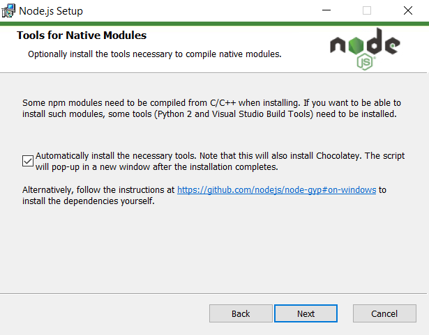

# neutrino-preset-react-nodegui

`neutrino-preset-react-nodegui` is a [Neutrino](https://neutrino.js.org) preset for [React NodeGUI](https://react.nodegui.org/) applications development.

[![NPM version][npm-image]][npm-url]
[![NPM downloads][npm-downloads]][npm-url]
[![Build Status][build-status]][travis-url]

## What is Neutrino?

[Neutrino](https://neutrino.js.org) is a configuration engine that allows to bundle Webpack configurations or their parts as modules and publish them to NPM. Such modules usually are called presets or middlewares. They are designed to work in conjunction with Neutrino core in your project. You can compose compilation, linting, testing and other configurations, and share them to developers.

## What features does this preset provide?

This preset does all dirty job for setting up Webpack for you. It implements a setup of projects based on [NodeGUI and React](https://github.com/nodegui/react-nodegui).

### Features

- Zero upfront configuration necessary to start developing and building a React NodeGUI app
- Modern Babel compilation supporting ES modules, async functions, dynamic imports, ES class properties, rest spread operators, decorators and automatic polyfills bound to the platform
- Sourcemaps
- Tree-shaking to create smaller bundles
- Hot Module Replacement enabled with source-watching during development
- Disabled redundant `[HMR]` console messages
- Auto-open the application in the development mode
- Debug console cleared on every file change. Your outdated logs will be removed
- Webpack loaders for importing JSX components, TypeScript, CSS, images, icons and SVGs
- User-friendly building progress bar
- Detect and warn about circular dependencies during build time
- Git revision information through environment variables (VERSION, COMMITHASH, BRANCH)
- Consider external dependencies sourcemaps for better debugging during development
- Production-optimized bundles with minification
- Resolve URLs in JSX like in HTML for these elements: `img[src]`, `link[href]`, `Image[src]`, `video[src]`, `Video[src]`, `audio[src]`, `Audio[src]`

## Requirements

- Node.js v12+
- Neutrino v9
- React NodeGUI v0.4.0+
- Webpack v4
- CMake v3.1+ (https://cmake.org/install/)
- 64 bit OS
- Windows 7+, macOS 10.10+, Ubuntu 16.04+ and Debian 10+
- **Make and GCC v7** on Unix or **Visual Studio Build Tools 2017** on Windows

## Prerequisites

Before the installation you need to correctly setup your environment.

1. Upgrade to NodeJS v12 or higher. The newest Node installer on Windows proposes to *automatically install all necessary tools* for native modules compilation. To avoid manual setup, it is highly recommended to **opt-in** to this option:



2. Install CMake 3.1 or higher to your system if not already. Instructions can be found here: https://cmake.org/install/

3. If you are on Mac or Linux make sure `make` and `gcc` are installed

4. On Ubuntu and Ubuntu-based distros it is advisable to run `sudo apt-get update`, followed by `sudo apt-get install pkg-config build-essential`

5. On Windows no extra steps are required if you did everything as suggested in the point **1**. But if you decided to setup build tools manually you have several options describe in [this documentation](https://github.com/nodejs/node-gyp#on-windows) :
   - Install Visual Studio 2017
   - Install Visual Studio Build Tools

If everything is correct [NodeGUI](https://nodegui.org/) will be compiled on initial `npm install` (on 'postinstall' phase). You can find more details about environment setup in the [official documentation](https://react.nodegui.org/docs/guides/getting-started)

## Installation

`neutrino-preset-react-nodegui` can be installed with NPM. Inside your project, make sure `neutrino`, `webpack` and `neutrino-preset-react-nodegui` are development dependencies.

```bash
npm install --save @nodegui/nodegui @nodegui/react-nodegui react
npm install --save-dev neutrino neutrino-preset-react-nodegui webpack webpack-cli
```

Now edit your project's `package.json` to add commands for starting and building the application:

```json
{
  "scripts": {
    "build": "webpack --mode production",
    "start": "webpack --mode development",
    "open": "qode --inspect ./build/index.js"
  }
}
```

Then add the new file `.neutrinorc.js` in the root of the project:

```js
let reactNodegui = require('neutrino-preset-react-nodegui')

module.exports = {
   use: [
      reactNodegui()
   ]
}
```

And create a `webpack.config.js` file in the root of the project, that uses the Neutrino API to access the generated webpack config:

```js
let neutrino = require('neutrino')

module.exports = neutrino().webpack()
```

## Project Layout

`neutrino-preset-react-nodegui` follows the standard [project layout](https://neutrino.js.org/project-layout) specified by Neutrino. This means that by default all project source code should live in a directory named `src` in the root of the project. This includes JavaScript files, stylesheets, images, and any other assets that would be available to your compiled project. Only files explicitly imported or lazy loaded to your project will be bundled. You may use JavaScript or TypeScript for development. The entry file may be any of both: `src/index.jsx` or `src/index.tsx`

## Quickstart

After installing Neutrino and this preset, add a new directory named `src` in the root of the project, with a single JSX file named `index.jsx` in it. The preset cares about mounting to the native environment and hot reload configuration. You only have to export your main component that refers to your application. Edit `src/index.jsx` file with the following:

```jsx
import { Text, Window, View } from '@nodegui/react-nodegui'
import React from 'react'

// import { QIcon } from '@nodegui/nodegui'
// import logoIcon from './logo.png'

const styleSheet = `
  #header {
    font-size: 34px;
    padding-top: 20px;
    qproperty-alignment: "AlignHCenter";
  }
`

export default class App extends React.Component {
   render () {
      return (
         <Window
            windowTitle="Hello world"
            minSize={{ width: 500, height: 300 }}
            styleSheet={styleSheet}

            // windowIcon={new QIcon(logoIcon)}
         >
            <View>
               <Text id="header">I am a C++ programmer</Text>
            </View>
         </Window>
      )
   }
}
```

You can change this code base to better match your needs. Import other parts of your application and render them inside. More projects examples can be found [here](https://github.com/nodegui/examples/tree/master/react-nodegui)

Start the app in a development mode:

```bash
npm start
```

The console shows that application compilation is finished and can be inspected. Also the application itself will open in a new window.

## Building

The project builds static assets to the `build` directory by default when running `npm run build`:

```bash
❯ webpack --mode production

√ React-nodegui-starter 1.0.0 (NodeGui)
  Compiled successfully in 15.77s

Version: webpack 4.41.5
Time: 15700ms
Built at: 2020-01-29 23:46:56
                                             Asset      Size  Chunks             Chunk Names
       images/1d535df5e2e3bb126160e27b9235024f.jpg  58.1 KiB          [emitted]
nodegui_core-fdbc23f7957be55a3ba3fc4d551e99ac.node  1.13 MiB          [emitted]
                                          index.js   365 KiB       0  [emitted]  index
```

You can start a production version of built application with `npm run open`:

```bash
❯ qode --inspect ./build/index.js

Debugger listening on ws://127.0.0.1:9229/bed4554e-8aa3-4547-8d7c-563e4be534a5
For help, see: https://nodejs.org/en/docs/inspector
```

The production code can be inspected with remote debugger. But the sourcemaps will not work until you enable them for production in [options](#Preset-options)

## Hot Module Replacement

As `neutrino-preset-react-nodegui` completely controls the launching of your application instance. It automatically enables Hot Module Replacement for all files during development. No extra configuration or changes in your source code are necessary. You don't need to restart the application every time files are changed.

Using dynamic imports with `import()` will automatically create split points and hot replace those modules upon modification during development.

## Styles

As QT uses its [own proprietary stylesheet syntax](https://doc.qt.io/qt-5/stylesheet-syntax.html) this preset supports loading CSS as a string. You can use it like this

```jsx
import { View, Text } from '@nodegui/react-nodegui'

import styles from './styles.css'

let element = (
   <View styleSheet={styles}>
      <Text id="header">I am a C++ programmer</Text>
   </View>
)
```

## Preset options

You can provide custom options and have them merged with this preset's default options to easily affect how this preset works. You can modify the preset settings from `.neutrinorc.js` by an options object.

The following shows how you can pass an options object to the preset and override its options, showing the defaults:

#### .neutrinorc.js

```js
let reactNodegui = require('neutrino-preset-react-nodegui')

module.exports = {
   use: [
      reactNodegui({
         // Inject an application startup launcher. When `false` you need to setup mounting and HMR in your sorce code
         launcher: true,

         // Clear console on every build
         clean: true,

         // The process title
         title: `${packageJson.name} ${packageJson.version}`,

         // Automatically open app on `npm start` and attach it to the compilation process
         open: true,

         // Enable source maps in the production build. Development sourcemaps are not affected and always turned on
         sourcemaps: false,

         // Add all necessary polyfills required to support NodeJS depending on the usage in the code
         polyfills: true
      })
   ]
}
```

*Example: Disable auto-opening and always generate sourcemaps:*

#### .neutrinorc.js

```js
let reactNodegui = require('neutrino-preset-react-nodegui')

module.exports = {
   use: [
      reactNodegui({
         sourcemaps: true,
         open      : false
      })
   ]
}
```

## Customizing

Consumers may provide their custom Webpack configurations for different parts of the current preset that will override its defaults. Also if you want to construct your own preset based on `neutrino-preset-react-nodegui` you can use information below.

To override the build configuration, start with the documentation on [customization](https://neutrino.js.org/customization). `neutrino-preset-react-nodegui` creates some conventions to make overriding the configuration easier once you are ready to make changes. Following the customization guide and knowing the rule, loader, and plugin IDs, you can override and augment the build by providing a function to your `.neutrinorc.js` use array. You can also make these changes from the Neutrino API in a custom middleware.

By default Neutrino, and therefore this preset, creates a single **main** `index` entry point to your application, and this maps to the `index.*` file in the `src` directory.

> **Important! This preset has a limitation – it supports only a single entry point when the launcher option is enabled. Defining 2 or more may cause it to work not properly.**

You can customize a single entry point in your `.neutrinorc.js` and override a default one

```js
let reactNodegui = require('neutrino-preset-react-nodegui')

module.exports = {
   options: {
      mains: {
         index: './App.jsx'
      }
   },
   use: [
      reactNodegui()
   ]
}
```

### Launcher

This preset wraps your application with NodeGUI renderer and Hot container. It can be configured using `launcher` property in the [preset options](#preset-options). So you don't need to think about how to mount and render your application. This is completely managed by `neutrino-preset-react-nodegui` preset.

If you want to **disable** the launcher you need to explicitly set the option to `false`

```js
reactNodegui({
   launcher: false
})
```

This turns your application into a regular Node.js application. You will have to manage starting by yourself as it is described in [NodeGUI documentation](https://react.nodegui.org/docs/guides/tutorial).

## Webpack config

Sometime you want to extend Webpack configuration with custom loaders or plugins. This can be done in `.neutrinorc.js` file using [Neutrino API](https://neutrinojs.org/webpack-chain/) also known as [`webpack-chain`](https://www.npmjs.com/package/webpack-chain).

### Plugins

For example, you can add [TypeScript checking](https://www.npmjs.com/package/fork-ts-checker-webpack-plugin)

```js
let reactNodegui = require('neutrino-preset-react-nodegui')
let TsChecker    = require('fork-ts-checker-webpack-plugin')

module.exports = {
   use: [
      reactNodegui(),
      function (neutrino) {
         let productionMode = (process.env.NODE_ENV === 'production')

         if (productionMode) return

         neutrino.config
            .plugin('ts-checker')
               .use(TsChecker, [{
                  // options
               }])
               .end()
      }
   ]
}
```

Specifically for this plugin you also need to create `tsconfig.json` file

```json
{
   "compilerOptions": {
      "target": "es2016",
      "module": "commonjs",
      "jsx": "react",
      "strict": true,
      "alwaysStrict": true,
      "moduleResolution": "node",
      "esModuleInterop": true
   },
   "include": ["src/**/*"],
   "exclude": ["node_modules"]
}
```

It will enable highlighting in your code editor too.

## VSCode tips

### Project settings

These are suggested workspace settings for VSCode editor:

#### .vscode/settings.json

```json
{
   "files.autoSave": "onFocusChange"
}
```

This should prevent building as you type code.

### Launching in the VSCode Debugger

Visual Studio Code has its own built-in debugger. You may launch and debug your application in the development and production modes using it. Add this configuration:

#### launch.json

```json
{
   "version": "0.2.0",
   "configurations": [
      {
         "name": "Start",
         "type": "node",
         "request": "launch",
         "program": "${workspaceFolder}/node_modules/webpack/bin/webpack.js",
         "args": ["--mode", "development"],
         "autoAttachChildProcesses": true,
         "internalConsoleOptions": "openOnSessionStart",
         "skipFiles": ["<node_internals>/**"],
         "sourceMaps": true
      },
      {
        "name": "Open",
        "type": "node",
        "request": "launch",
        "cwd": "${workspaceFolder}",
        "runtimeExecutable": "${workspaceFolder}/node_modules/.bin/qode",
        "windows": {
          "runtimeExecutable": "${workspaceFolder}/node_modules/.bin/qode.cmd"
        },
        "args": ["./build/index.js"],
        "outputCapture": "std",
        "skipFiles": ["<node_internals>/**"],
        "sourceMaps": true
      },
      {
        "name": "Debug",
        "type": "node",
        "request": "attach",
        "port": 9229,
        "skipFiles": ["<node_internals>/**"],
        "sourceMaps": true
      }
   ]
}
```

Use these 3 tasks for different purposes

- **Start** instead of `npm start`. Builds with live reloading and opens app.
- **Open** instead of `npm run open`. Opens what was built.
- **Debug** when want to attach to a manually opened app with `--inspect` flag.

## CI/CD tips

### Travis CI

To build your application in [Travis](https://travis-ci.com/) you need to configure a compatible environment. Suggested settings to make it work are

#### .travis.yml

```yml
os: linux
dist: bionic
language: node_js
node_js:
  - "12"
```

## Knowledge base

- [Qt Quick QML Types](https://doc.qt.io/qt-5/qtquick-qmlmodule.html)
- [The Style Sheet Syntax](https://doc.qt.io/qt-5/stylesheet-syntax.html)
- [Qt Style Sheets Examples](https://doc.qt.io/qt-5/stylesheet-examples.html)
- [Qt Style Sheets Reference](https://doc.qt.io/qt-5/stylesheet-reference.html)

[npm-image]: https://img.shields.io/npm/v/neutrino-preset-react-nodegui.svg
[npm-downloads]: https://img.shields.io/npm/dt/neutrino-preset-react-nodegui.svg
[npm-url]: https://npmjs.org/package/neutrino-preset-react-nodegui
[build-status]: https://travis-ci.com/constgen/neutrino-preset-react-nodegui.svg?branch=master
[travis-url]: https://travis-ci.com/constgen/neutrino-preset-react-nodegui
